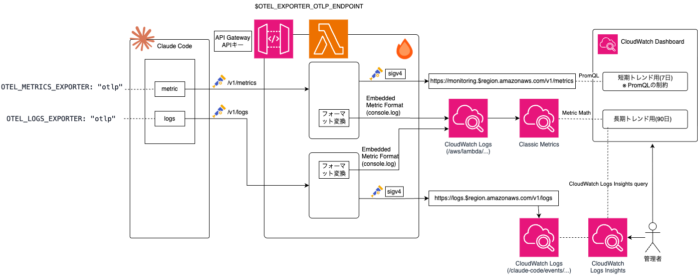

# claude-code-usage-dashboard

Claude Code の利用状況を組み込みの OpenTelemetry テレメトリで収集し、CloudWatch で可視化するテンプレート。ローカルに常駐プロセスを置かず、CDK スタック 1 つのデプロイで完結する。

## アーキテクチャ



- AWS の OTLP 受け口は SigV4 認証が基本だが、Claude Code のエクスポーターは静的ヘッダーしか付けられないため、Hono(Lambda)が署名を担う
- CloudWatch OTLP ストア(PromQL)は 1 クエリ最大 7 日のため、Hono が同一ペイロードから EMF で Classic メトリクスを複製し長期観測を担保する(短期 = PromQL / 長期 = Metric Math の二層構成)
- OTLP は `http/json` 必須(EMF 派生で JSON パースするため)
- `OTEL_LOG_TOOL_DETAILS=1` で乗ってくるツール詳細(`tool_parameters`: Bash コマンド本文・ファイルパス等)は、Lambda が転送前にインラインで除去し、集計に使う識別子(`subagent_type` / `mcp_server_name` / `skill_name`)だけを通す。全ペイロードがこのプロキシを通るため、別 Lambda + Raw/Sanitized の 2 段構成(取り込み 2 重課金)が不要

シグナル別の AWS 側 OTLP 受け口と、認証方式ごとの東京(ap-northeast-1)対応は次のとおり。

| シグナル | Claude Code の送出 | 受け口 (エンドポイント) | SigV4 | Bearer Token |
| --- | --- | --- | --- | --- |
| metrics | ○ 送出する | CloudWatch Metrics (`monitoring.*/v1/metrics`) | ○ 東京可 | ○ 東京可 |
| logs | ○ 送出する(イベントログ) | CloudWatch Logs (`logs.*/v1/logs`) | ○ 東京可 | × 東京不可(US 4 リージョン限定 ※) |
| traces | × 送出しない | X-Ray (`xray.*/v1/traces`) | ○ 東京可 | × 非対応 |

※ us-east-1 / us-east-2 / us-west-1 / us-west-2

Bearer Token が logs では US 4 リージョン限定のため、東京リージョンでは静的ヘッダーだけでイベントログを直接送れない。これが東京でプロキシ(SigV4)を挟む理由。

## テレメトリの種類とルーティング

Claude Code の組み込み OTel が送出するのは**メトリクス**と**イベントログ**の 2 シグナル(トレースは送出しない)。エクスポーターは `OTEL_EXPORTER_OTLP_ENDPOINT` をベース URL として、メトリクスを `POST /v1/metrics`、イベントを `POST /v1/logs` に送る。

### メトリクス (`OTEL_METRICS_EXPORTER=otlp` → `/v1/metrics`)

| メトリクス | 内容 | 主な属性 |
| --- | --- | --- |
| `claude_code.cost.usage` | API 換算コスト (USD) | `model` |
| `claude_code.token.usage` | トークン数 | `type` (input/output/cacheRead/cacheCreation), `model` |
| `claude_code.session.count` | セッション開始数 | |
| `claude_code.lines_of_code.count` | 変更コード行数 | `type` (added/removed) |
| `claude_code.commit.count` | コミット数 | |
| `claude_code.pull_request.count` | PR 作成数 | |
| `claude_code.code_edit_tool.decision` | 編集ツールの受入判定 | `decision` (accept/reject), `tool` |
| `claude_code.active_time.total` | アクティブ時間 (秒) | |

**1. `/v1/metrics` に届くペイロードの形(模擬サンプル)** — OTLP ストアは PromQL 専用で raw JSON を取り出す CLI が無いため、ここだけ模擬。構造は実測に合わせている(OTLP http/json では int64 が文字列で届く、delta temporality 前提):

```json
{
  "resourceMetrics": [
    {
      "resource": {
        "attributes": [
          { "key": "service.name", "value": { "stringValue": "claude-code" } },
          { "key": "service.version", "value": { "stringValue": "2.1.201" } }
        ]
      },
      "scopeMetrics": [
        {
          "scope": { "name": "com.anthropic.claude_code" },
          "metrics": [
            {
              "name": "claude_code.cost.usage",
              "unit": "USD",
              "sum": {
                "aggregationTemporality": 1,
                "isMonotonic": true,
                "dataPoints": [
                  {
                    "timeUnixNano": "1783386411561000000",
                    "asDouble": 0.39902,
                    "attributes": [
                      { "key": "model", "value": { "stringValue": "claude-fable-5" } }
                    ]
                  }
                ]
              }
            },
            {
              "name": "claude_code.token.usage",
              "sum": {
                "aggregationTemporality": 1,
                "isMonotonic": true,
                "dataPoints": [
                  {
                    "timeUnixNano": "1783386411561000000",
                    "asInt": "6587",
                    "attributes": [
                      { "key": "type", "value": { "stringValue": "input" } },
                      { "key": "model", "value": { "stringValue": "claude-fable-5" } }
                    ]
                  },
                  {
                    "timeUnixNano": "1783386411561000000",
                    "asInt": "3",
                    "attributes": [
                      { "key": "type", "value": { "stringValue": "output" } },
                      { "key": "model", "value": { "stringValue": "claude-fable-5" } }
                    ]
                  }
                ]
              }
            }
          ]
        }
      ]
    }
  ]
}
```

**2. プロキシが派生させる EMF レコード(実データ、2026-07-07 取得)** — 上のペイロードを受けたプロキシが `console.log` に出力する 1 行:

```bash
aws logs filter-log-events \
  --log-group-name <ProxyFn のロググループ> \
  --filter-pattern Tokens --limit 1 \
  --query 'events[0].message' --output text
```

```json
{
  "_aws": {
    "Timestamp": 1783386335862,
    "CloudWatchMetrics": [
      {
        "Namespace": "claude-code",
        "Dimensions": [["type"]],
        "Metrics": [{ "Name": "Tokens", "Unit": "None" }]
      }
    ]
  },
  "type": "input",
  "Tokens": 1
}
```

**3. 派生後の Classic メトリクス値(実データ)** — `aws cloudwatch get-metric-data` (Namespace `claude-code`, MetricName `Tokens`, `type=input`, 1h Sum):

```json
{ "Id": "tokens", "Timestamps": ["2026-07-07T13:00:00+09:00", "2026-07-07T12:00:00+09:00"], "Values": [1355.0, 4.0], "StatusCode": "Complete" }
```

### イベント (`OTEL_LOGS_EXPORTER=otlp` → `/v1/logs`)

`body` にイベント完全名、`attributes` に詳細が入る (2026-07-07 実測。数値・boolean 属性は文字列で届く)。

| イベント | 内容 |
| --- | --- |
| `claude_code.api_request` | API 呼び出し 1 回。`model` / `cost_usd` / 各種トークン数 / `skill.name` 等 |
| `claude_code.api_error` | API エラー。`error` / `status_code` |
| `claude_code.user_prompt` | プロンプト送信。本文は既定でリダクション |
| `claude_code.assistant_response` | アシスタント応答 |
| `claude_code.tool_result` | ツール実行結果。`tool_name` / `success` / `duration_ms` / `error_type` |
| `claude_code.tool_decision` | ツール実行の許可判定 |
| `claude_code.skill_activated` | スキル発動。`skill.name` / `invocation_trigger` / `skill.source` |
| `claude_code.hook_registered` / `hook_execution_start` / `hook_execution_complete` | フック登録・実行 |
| `claude_code.mcp_server_connection` | MCP サーバ接続 |
| `claude_code.at_mention` | @ メンション |


実際に `/claude-code/events` へ格納されたイベントの実物 (2026-07-07 取得。識別子とメールはマスク):

```bash
aws logs filter-log-events \
  --log-group-name /claude-code/events \
  --filter-pattern claude_code.api_request --limit 1 \
  --query 'events[0].message' --output text
```

```json
{
  "resource": {
    "attributes": {
      "host.arch": "arm64",
      "os.type": "darwin",
      "service.name": "claude-code",
      "service.version": "2.1.201",
      "os.version": "24.6.0"
    }
  },
  "scope": { "name": "com.anthropic.claude_code.events", "version": "2.1.201" },
  "timeUnixNano": 1783386411561000000,
  "observedTimeUnixNano": 1783386411561000000,
  "severityNumber": 0,
  "severityText": "",
  "body": "claude_code.api_request",
  "attributes": {
    "cost_usd": 0.39902000000000004,
    "query_source": "sdk",
    "service.name": "claude-code",
    "user.id": "f1569cde****(sha256)",
    "user.account_uuid": "04d111cd-****-****-****-************",
    "terminal.type": "tmux",
    "event.name": "api_request",
    "effort": "xhigh",
    "cache_read_tokens": 0,
    "event.timestamp": "2026-07-07T01:06:51.561Z",
    "input_tokens": 6587,
    "speed": "normal",
    "prompt.id": "4f117b7a-****-****-****-************",
    "duration_ms": 5202,
    "event.sequence": 6,
    "cost_usd_micros": 399020,
    "user.email": "user@example.com",
    "organization.id": "69a90af7-****-****-****-************",
    "cache_creation_tokens": 16650,
    "model": "claude-fable-5",
    "output_tokens": 3,
    "user.account_id": "user_****",
    "request_id": "req_****"
  },
  "traceId": "",
  "spanId": ""
}
```

### 格納先は 3 つ

プロキシ(Hono on Lambda)は受信ペイロードを**素通し転送**しつつ、その一部だけを **EMF で Classic メトリクスに複製**する。

| 格納先 | 入るもの | クエリ手段 |
| --- | --- | --- |
| CloudWatch OTLP ストア (`monitoring.*/v1/metrics` へ転送) | **全メトリクス**(素通し) | PromQL (1 クエリ最大 7 日) |
| ロググループ `/claude-code/events` (`logs.*/v1/logs` へ転送, 13ヶ月) | **全イベント**(素通し) | Logs Insights |
| Classic メトリクス (EMF 派生, namespace `claude-code`, 15ヶ月) | **下表の選抜のみ** | Metric Math |

EMF で Classic 化しているのは次の 4 系列だけ。

| Classic メトリクス | 派生元 | 変換 |
| --- | --- | --- |
| `Cost` | `claude_code.cost.usage` (メトリクス) | `metricsToEmf` |
| `Tokens` (dimension: `type`) | `claude_code.token.usage` (メトリクス) | `metricsToEmf` |
| `ToolCalls` / `ToolFailures` | `claude_code.tool_result` (**イベント**) | `logsToEmf` |

### 選抜基準

- **低カーディナリティで常時トレンドを見たいもの** (コスト・トークン・ツール失敗率) → EMF で Classic 化。表示が無料・高速で、アラームも設定でき、15 ヶ月の長期トレンドが引ける。ToolCalls/ToolFailures はメトリクスとして存在しないため、イベントから数えて作る唯一の派生
- **高カーディナリティ・探索的な集計** (スキル名別・モデル別詳細・エラー内訳) → ログのまま Logs Insights で都度集計。Classic メトリクスは「名前 × dimension 値」1 系列ごとに月額課金されるため、スキル名のような非有界の値を dimension にしない
- **計測ポリシーで掲示しないもの** (session / lines_of_code / active_time / commit / PR / 編集受入) → EMF 化しない。OTLP ストアには素通しで入るため、必要になればアドホックに参照は可能

### 消費側 (ダッシュボード・保存クエリ)

上の 3 つの格納先を、それぞれ次の消費側が参照する。

| 消費側 | データ源 | 内容 |
| --- | --- | --- |
| ダッシュボード `claude-code-ops` (直近の運用・診断) | OTLP ストア (PromQL) + `/claude-code/events` (Logs Insights) | Cost / Tokens(type・model 別) / Skill activations / Skill cost / Tool failure rate / Tool failures / API errors |
| ダッシュボード `claude-code-trends` (長期トレンド) | Classic メトリクス (Metric Math) | Cost / Tokens / Tool failure rate の日次版。月次推移はこちら |
| 保存クエリ (`claude-code/` フォルダ) | `/claude-code/events` (Logs Insights) | daily-cost / daily-token-usage / tool-usage-summary / skill-activations / skill-cost / api-errors |

## 計測ポリシー

DORA / SPACE の考え方に沿い、グッドハートの法則(指標が目標になると指標として壊れる)を踏まえる。

- **チーム集計のみを常設表示**。個人別(user.email 等)のウィジェット・保存クエリは置かない(テレメトリ属性としては残るため、調査はアドホックに可能)
- **量産系・生産性系メトリクス(コード行数・アクティブ時間・セッション数・commit/PR 数・編集受入率)を成果として掲示しない**
- **コスト・トークンは予算管理の文脈に隔離**し、効率評価や個人比較に使わない

## セットアップ

前提: Node.js 24+ / pnpm / AWS CLI 認証設定済み

```bash
# 1. 依存インストール
pnpm install

# 2. デプロイ (ダッシュボード×2 + ロググループ + OTLPプロキシ)
cd iac/aws
pnpm cdk bootstrap   # 初回のみ
AWS_PROFILE=<your-profile> pnpm deploy
# Outputs の OtlpEndpoint と ApiKeyId を控える

# 3. api key の値を取得
aws apigateway get-api-key --api-key <ApiKeyId> --include-value --query value --output text

# 4. ローカル設定 (秘匿情報のため gitignore 対象)
cp .claude/settings.local.json.example .claude/settings.local.json
# OTEL_EXPORTER_OTLP_ENDPOINT と x-api-key を書き換える

# 5. Claude Code をこのプロジェクトで再起動
```

既存プロジェクトへの組み込みは `.claude/settings.json` の env と `.claude/settings.local.json` を転記するだけ。API とダッシュボードは全プロジェクト共用。

## セキュリティ

- プロンプト本文・応答本文・ツール引数は既定でリダクションされる(`OTEL_LOG_USER_PROMPTS` 等を有効化しない限り本文は送信されない)
- `OTEL_LOG_TOOL_DETAILS=1` を有効化している(スキル名の実名記録に必要)が、ツール詳細の本文はプロキシ内の sanitizer (`apps/otlp-proxy/src/sanitize.ts`) がロググループ着地前に除去する
- WAF は IP 制限の枠組みを持つ(既定は全開放)。絞る場合は `iac/aws/lib/config.ts` の `allowedIps` を `['<IP>/32']` に変更
- api key は書き込み専用(読み取り不可)。漏洩時は usage plan から即失効

## 構成

```
apps/otlp-proxy/        # Hono アプリ (SigV4転送 + EMF変換)
iac/aws/                # CDK (APIG + Lambda + ダッシュボード×2 + ロググループ + WAF)
.claude/settings.json   # Claude Code テレメトリ設定 (非秘匿 env)
```
